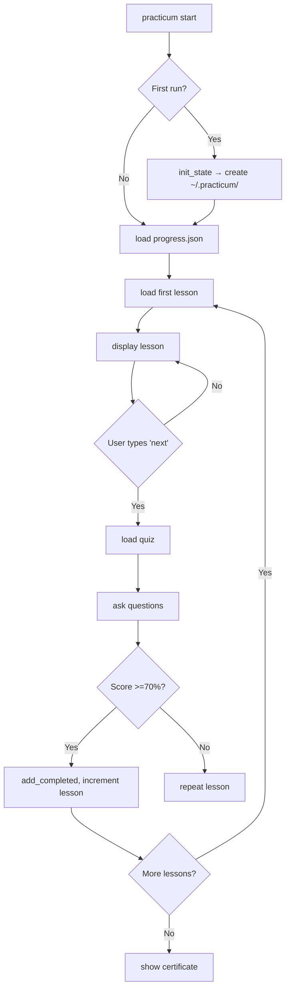
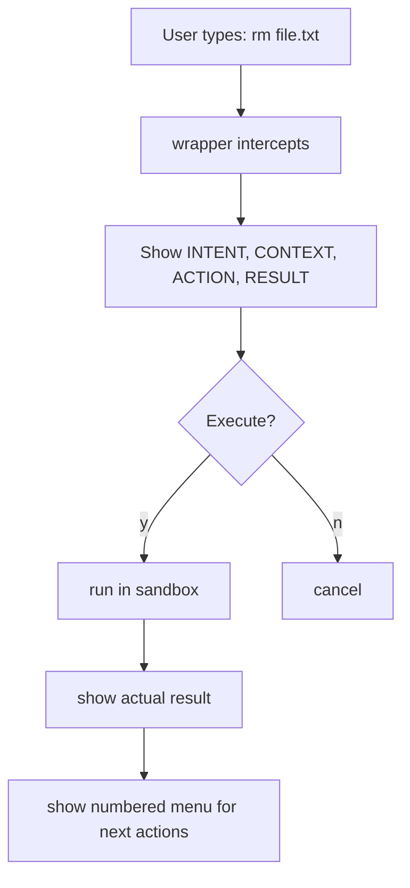

## Design Artifacts for Practicum CLI

Based on our entire conversation, I have extracted and structured all design decisions into a complete set of **design artifacts**. These artifacts serve as the single source of truth for Claude Code and the development team.

---

# 📁 Artifact 1: System Architecture

## 1.1 High‑Level Component Diagram

```
┌─────────────────────────────────────────────────────────────────────────┐
│                           USER TERMINAL                                  │
│                     (bash / zsh / PowerShell)                           │
└────────────────────────────────┬────────────────────────────────────────┘
                                 │
                                 ▼
┌─────────────────────────────────────────────────────────────────────────┐
│                         practicum (bash entrypoint)                      │
├───────────────┬───────────────┬───────────────┬─────────────────────────┤
│   Command     │    State      │    Mode       │      Course Loader       │
│   Dispatcher  │   Manager     │   Switcher    │                          │
└───────┬───────┴───────┬───────┴───────┬───────┴────────────┬────────────┘
        │               │               │                    │
        ▼               ▼               ▼                    ▼
┌───────────────┐ ┌─────────────┐ ┌─────────────┐ ┌─────────────────────┐
│  lib/wrappers │ │ lib/state.sh│ │ lib/modes.sh│ │ courses/            │
│  .sh          │ │             │ │             │ │ linux-foundations/  │
│  (command     │ │ (JSON via   │ │ (LAB, FIELD,│ │   day1/              │
│   overrides)  │ │  grep/sed)  │ │  WIZARD,    │ │     lesson*.txt     │
└───────────────┘ └─────────────┘ │  LMS)       │ │     quiz*.txt       │
                                  └─────────────┘ └─────────────────────┘
```

## 1.2 Data Flow – Wizard Mode

```
User: practicum wizard
         │
         ▼
[state.sh] → load progress.json → get current_lesson
         │
         ▼
[course loader] → read courses/.../lessonN.txt
         │
         ▼
[display] → less or cat
         │
         ▼
[quiz engine] → read quizN.txt → ask questions → score
         │
         ▼
[state.sh] → if score >=70% → add_completed(lesson) → increment current_lesson
         │
         ▼
[loop] → next lesson or exit
```

## 1.3 Data Flow – Lab Mode (Sandbox)

```
User: practicum lab
         │
         ▼
[mode.sh] → set PRACTICUM_MODE=LAB
         │
         ▼
[wrappers.sh] → override cd, ls, mkdir, touch, rm
         │
         ▼
All commands → chroot to ~/.practicum/sandbox/
         │
         ▼
Actual filesystem → untouched
```

---

# 📁 Artifact 2: Data Models

## 2.1 progress.json (stored in `~/.practicum/`)

```json
{
  "completed": ["pwd", "ls", "cd"],
  "scores": {
    "day1_quiz_pwd": 100,
    "day1_quiz_ls": 80
  },
  "unlocked": ["pwd", "ls", "cd", "mkdir"],
  "current_lesson": "courses/linux-foundations/day1/lesson2_ls.txt",
  "course": "linux-foundations"
}
```

## 2.2 config (stored in `~/.practicum/config`)

```
PRACTICUM_MODE=WIZARD
PRACTICUM_COURSE=linux-foundations
PRACTICUM_SANDBOX=/home/user/.practicum/sandbox
```

## 2.3 Lesson File Format (plain text)

```text
# Lesson: pwd – Print Working Directory

## [WHEN] You need this when:
1. You just logged into a server and forgot where you are.
2. A script says "file not found" and you need to confirm the path.
3. You've used `cd` several times and are lost.

## [INTENT] "Where am I?"

## [ACTION] pwd

## [EXPECTED RESULT]
Shows the absolute path of the current directory.

## Try it:
Type `pwd` now.

## Next:
Type `next` to take the quiz.
```

## 2.4 Quiz File Format

```text
Q1: What command shows your current directory?
A) ls
B) pwd
C) cd
D) whoami
Correct: B

Q2: Which flag shows all files including hidden?
A) -a
B) -l
C) -h
D) -R
Correct: A
```

---

# 📁 Artifact 3: State Machine (Modes)

## 3.1 Mode Transitions

```
                    ┌─────────────────────────────────────┐
                    │                                     │
                    ▼                                     │
              ┌──────────┐                               │
              │  WIZARD  │                               │
              └────┬─────┘                               │
                   │ practicum field                     │
                   ▼                                     │
              ┌──────────┐     practicum lab             │
              │  FIELD   │◄──────────────────────────────┤
              └────┬─────┘                               │
                   │ practicum lab                       │
                   ▼                                     │
              ┌──────────┐                               │
              │   LAB    │───────────────────────────────┘
              └──────────┘     practicum wizard
```

## 3.2 Mode Characteristics

| Mode | Wrappers Active | Sandbox | Confirmations | Real System Access |
|------|----------------|---------|---------------|--------------------|
| WIZARD | ✅ Yes | ✅ (implicit) | ✅ All commands | ❌ No (sandbox) |
| LAB | ✅ Yes | ✅ Explicit | ❌ None (free) | ❌ No |
| FIELD | ❌ No | ❌ No | ⚠️ Warnings only | ✅ Yes |
| LMS | ❌ No | ❌ No | ❌ No | ✅ Yes (read‑only) |

---

# 📁 Artifact 4: User Flows (Critical Paths)

## 4.1 First‑time User Flow



## 4.2 Safe Command Execution (Wizard)



---

# 📁 Artifact 5: Component Specifications

## 5.1 `lib/state.sh`

| Function | Description | Returns |
|----------|-------------|---------|
| `init_state` | Creates `~/.practicum/` and default JSON | 0 on success |
| `add_completed lesson` | Appends lesson to `completed` array | 0 if added, 1 if duplicate |
| `is_unlocked lesson` | Checks if lesson in `unlocked` array | 0 if unlocked, 1 if locked |
| `save_score quiz_name score` | Stores score in `scores` object | 0 on success |
| `get_current_lesson` | Reads `current_lesson` from JSON | prints path |
| `set_current_lesson path` | Updates `current_lesson` | 0 on success |

**Locking:** All functions use `flock` on `~/.practicum/state.lock`.

## 5.2 `lib/wrappers.sh`

| Override | Behavior in WIZARD/LAB | In FIELD |
|----------|------------------------|----------|
| `cd` | Change to sandbox path | Normal |
| `ls` | List sandbox directory | Normal |
| `mkdir` | Create in sandbox | Normal |
| `touch` | Create in sandbox | Normal |
| `rm` | Delete from sandbox after confirmation | Normal with warning |

## 5.3 `lib/modes.sh`

| Function | Effect |
|----------|--------|
| `set_mode wizard` | `PRACTICUM_MODE=WIZARD`, load wrappers, set prompt |
| `set_mode lab` | `PRACTICUM_MODE=LAB`, load wrappers, set prompt, cd to sandbox |
| `set_mode field` | Unset wrappers, normal prompt, real system |
| `set_mode lms` | No wrappers, read‑only state queries |

---

# 📁 Artifact 6: Course Content Schema

## 6.1 Directory Structure

```
courses/
└── linux-foundations/          # Rank 1 course
    ├── day1/
    │   ├── lesson1_pwd.txt
    │   ├── quiz1_pwd.txt
    │   ├── lesson2_ls.txt
    │   ├── quiz2_ls.txt
    │   ├── lesson3_cd.txt
    │   └── quiz3_cd.txt
    ├── day2/
    │   ├── lesson4_grep.txt
    │   └── quiz4_grep.txt
    └── ...
```

## 6.2 Lesson Metadata (embedded in `.txt`)

Each lesson must contain at least:
- `[WHEN]` – 3+ real scenarios
- `[INTENT]` – natural language description
- `[ACTION]` – the command(s)
- `[EXPECTED RESULT]` – what the user sees
- Hands‑on exercise (optional but recommended)

---

# 📁 Artifact 7: Quality Attributes

| Attribute | Requirement | Measurement |
|-----------|-------------|-------------|
| **Portability** | Works on Linux, macOS, WSL | Test matrix |
| **Dependencies** | Zero (bash + coreutils) | `ldd` and `which` checks |
| **Response time** | <200ms for wrapped commands | `time` command |
| **Concurrency** | Locking prevents state corruption | Parallel `practicum status` |
| **Offline** | 100% offline after install | Air‑gapped test |
| **Recovery** | Ctrl+C, Ctrl+D handled gracefully | Manual test |

---

# 📁 Artifact 8: Development Phases & Sprints (Revised)

| Phase | Sprints | Status |
|-------|---------|--------|
| **0: Foundation** | 0.1 skeleton, 0.2 state, 0.3 status | ✅ Complete |
| **1: Core Pedagogy** | 1.1 wrappers, 1.2 intent resolver, 1.3 wizard flow | 🟡 In progress |
| **2: Course Content** | 2.1 day1 lessons, 2.2 day2, 2.3 day3, 2.4 day4, 2.5 day5 | 🔴 Not started |
| **3: LMS** | 3.1 quiz engine, 3.2 gating, 3.3 badges, 3.4 certs | 🔴 Not started |
| **4: Lab Enhancements** | 4.1 sandbox, 4.2 snapshots, 4.3 dry‑run | 🔴 Not started |
| **5: Payment** | 5.1 license, 5.2 purchase URL, 5.3 validation | 🔴 Not started |
| **6: Polish** | 6.1 installer, 6.2 docs, 6.3 beta, 6.4 launch | 🔴 Not started |

---

# 📁 Artifact 9: Error Handling & Edge Cases

| Scenario | Handling |
|----------|----------|
| `~/.practicum/` corrupted | Re‑initialize with backup (`.bak`) |
| No `less` command | Fallback to `cat` |
| Quiz file missing | Skip quiz, mark lesson as complete with warning |
| Concurrent writes | `flock` with 5‑second timeout, then fail gracefully |
| EOF (Ctrl+D) in wizard | Exit wizard, save progress |
| Network unavailable | No effect – all local |
| Sandbox disk full | Show error, suggest `practicum lab reset` |

---

# 📁 Artifact 10: Non‑Functional Requirements (NFRs)

| ID | Requirement | Priority |
|----|-------------|----------|
| NFR‑01 | Every command in WIZARD mode shows [INTENT], [CONTEXT], [ACTION], [RESULT] | P0 |
| NFR‑02 | Zero external dependencies (except optional `less`) | P0 |
| NFR‑03 | State persists after terminal close | P0 |
| NFR‑04 | No command exceeds 200ms (excluding intentional long ops) | P1 |
| NFR‑05 | Works over 9600 baud serial (no ANSI color required) | P2 |
| NFR‑06 | Student can always type `menu`, `back`, `status` to navigate | P0 |

---
 

 